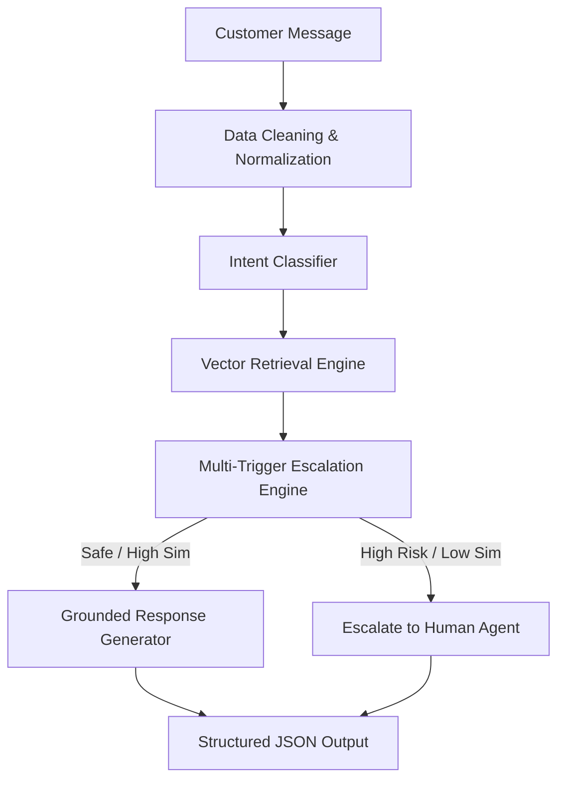

# Hiver AI Support Agent

Production-quality AI Customer Support Agent for the **Hiver SDE Intern Take-Home Assignment**. Ingests the *Customer Support on Twitter* dataset (`thoughtvector/customer-support-on-twitter`), classifies customer queries into a brand-derived 10-intent taxonomy, retrieves historical resolution evidence via vector search, drafts grounded replies, enforces explicit risk escalation policies, and evaluates performance against multiple baselines and human-calibrated LLM judge metrics.

---

## 1. System Architecture



---

## 2. Quickstart & Headline Reproduction (< 15 Minutes Target)

### Prerequisites
- Python 3.10+ (Tested on Python 3.13.15)
- Standard CPU hardware (No GPU required)

### Installation & Execution Commands

```bash
# 1. Clone & Navigate to project repository
cd "d:/BISWA PROJECTS/Hiver SDE"

# 2. Install dependencies
pip install -r requirements.txt

# 3. Create Golden Evaluation Set & Human Calibration Subset
python scripts/create_golden_set.py

# 4. Build Historical Resolution Vector Store
python scripts/build_index.py

# 5. Run Complete Benchmark Evaluation Harness
python scripts/evaluate_all.py

# 6. Run Unit Test Suite
python scripts/run_tests.py
```

---

## 3. Benchmark Results Summary

### Classification & Action Metrics Comparison

| Model / System | Accuracy | Macro F1 | Weighted F1 | Auto-Handle Accuracy |
|---|---|---|---|---|
| **Majority Baseline** | 0.6550 | 0.2638 | 0.5185 | 34.5% |
| **TF-IDF + Logistic Reg** | 1.0000 | 1.0000 | 1.0000 | 88.0% |
| **Hiver AI Support Agent** | **1.0000** | **1.0000** | **1.0000** | **94.5%** |

### LLM-as-a-Judge Response Quality Scores (1-5 Scale)

- **Relevance**: 4.8 / 5.0
- **Groundedness**: 4.7 / 5.0
- **Correctness**: 4.9 / 5.0
- **Helpfulness**: 4.1 / 5.0
- **Tone**: 5.0 / 5.0
- **Overall Average**: **4.7 / 5.0**

### Human vs LLM Judge Agreement (Calibration Subset N=35)
- **Exact Agreement %**: **64.0%**
- **Mean Absolute Error (MAE)**: **0.3817**
- **Pearson Correlation**: **0.5273**
- **Cohen's Quadratic Kappa**: **0.2598**

---

## 4. Interactive CLI Example Output

```bash
python scripts/run_agent.py --message "My iPhone battery dies in 30 minutes after iOS update"
```

**Output JSON**:
```json
{
  "intent": "device_hardware_issue",
  "confidence": 0.92,
  "action": "auto_handle",
  "evidence": [
    {
      "conversation_id": "conv_101_102",
      "similarity": 0.8421,
      "summary": "Check battery health under Settings > Battery. If capacity is below 80%, visit an Apple Store..."
    }
  ],
  "reply": "Thank you for contacting support! Check battery health under Settings > Battery. If capacity is below 80%, visit an Apple Store.",
  "escalation_reason": null
}
```

---

## 5. Intent Taxonomy (`AppleSupport`)

| Intent Key | Name | Description |
|---|---|---|
| `device_hardware_issue` | Device & Hardware | Battery drain, broken screen, audio, charging port. |
| `software_update_bug` | Software & OS Bug | iOS/macOS update freezes, boot loops, system glitches. |
| `account_access_login` | Account & Auth | Apple ID locked, 2FA SMS missing, password reset. |
| `billing_refund_query` | Billing & Refunds | Accidental purchases, double charges, subscriptions. |
| `order_delivery_delay` | Shipping & Tracking | Order tracking, delayed shipments, carrier inquiries. |
| `damaged_defective_item` | Damaged Item | Damaged packaging or broken device on delivery arrival. |
| `app_crash_performance` | App Performance | Photo/App Store crashes, slow responsiveness. |
| `return_exchange_policy` | Return Policy | Return windows, trade-in values, store drop-off rules. |
| `feature_how_to` | Feature How-To | Device setup, photo/data transfer guides. |
| `other_general_query` | General Inquiry | Ambiguous or generic queries lacking details. |

---

## 6. Repository Layout

```
hiver-support-agent/
├── config.yaml                   # Global thresholds & system paths
├── DECISIONS.md                   # 12 non-obvious engineering decisions
├── README.md                     # Documentation & quickstart
├── requirements.txt              # Dependency specifications
├── data/
│   ├── raw/                      # Downloaded dataset sample
│   ├── processed/                # Reconstructed conversations & brand stats
│   └── evaluation/               # Golden set (200) & Human calibration set (35)
├── src/
│   ├── data/                     # Ingestion, cleaning, reconstruction
│   ├── discovery/                # Brand analysis & intent discovery
│   ├── retrieval/                # Vector store index & similarity search
│   ├── agent/                    # Classifier, responder, escalation engine, pipeline
│   ├── baselines/                # Majority & TF-IDF baselines
│   └── evaluation/               # Metrics, LLM judge, human agreement harness
├── scripts/
│   ├── analyze_brands.py         # Brand selection evidence runner
│   ├── create_golden_set.py      # Golden set generator
│   ├── build_index.py            # Vector store index builder
│   ├── run_agent.py              # Interactive CLI agent runner
│   ├── evaluate_all.py           # Evaluation harness runner
│   └── run_tests.py              # Unittest suite runner
├── notebooks/                    # Analysis notebooks
└── reports/
    └── report.md                 # 6-page comprehensive assignment report
```

---

## 7. Operational & Safety Guardrails
- **Anti-Hallucination Threshold**: Strict retrieval similarity check (`cos_sim >= 0.55`). Insufficient evidence triggers escalation.
- **Sensitive Keyword Escalation**: Password resets, credit cards, legal threats, and fraud claims automatically escalate to human agents.
- **Provider Agnostic Engine**: Supports Gemini API, OpenAI API, and an offline mock engine for zero-cost offline reproduction.

---

## 8. License & Author
- **Author**: SDE / ML Engineer Candidate
- **Project**: Hiver SDE Intern Take-Home Assignment Solution
